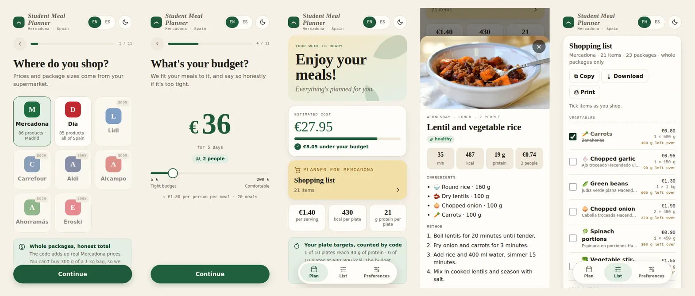

# Student Meal Planner

[](https://github.com/Matdimon90/student-meal-planner/actions/workflows/tests.yml)

AI meal planner and grocery budgeting for students living in Spain.

Answer eleven quick questions, one per screen: your supermarket (Mercadona or Dia), how many you are, the days and meals, your budget, the kind of food you like, diet and allergies, plate size, protein, what you don't eat, what is already at home and what your kitchen has. It returns a week of meals with a photo, cooking time, calories and protein for each, simple recipes, and a shopping list priced with that shop's real packages, compared with your budget, plus what the same basket would cost in the other shop. If the budget is not realistic, it says so.



Course project for DAT32-91 Prompt Engineering & Git, Albert School.

## Objective

Students cooking on a tight budget answer three questions every week: what do I cook, what do I buy, can I afford it? Recipe sites ignore the budget. Budget apps ignore the recipes. Neither knows that 100 g of rice still costs a full 1 kg bag.

Our goal: one tool that plans meals **and** tells the truth about what they cost at the till.

The project started as a different idea (recognising food in a fridge photo). Why we changed: [`docs/decisions.md`](docs/decisions.md).

## Team

| Name | GitHub |
| --- | --- |
| Matteo Asscher | [@Matdimon90](https://github.com/Matdimon90) |
| Oscar Kalil | [@oskr-kal](https://github.com/oskr-kal) |
| Tom Makhlouf | [@TomMakhlouf](https://github.com/TomMakhlouf) |

How we work together: [`CONTRIBUTING.md`](CONTRIBUTING.md).

## Tools

| Tool | Role |
| --- | --- |
| Python 3, FastAPI | Backend and all calculations |
| HTML, CSS, JavaScript (one file, no framework) | Web page, English and Spanish |
| Anthropic API (Claude Haiku 4.5 by default, Sonnet 5 optional) | Proposes meals and recipes as JSON |
| OpenCesta open dataset | Real Mercadona and Dia prices, dated snapshot |
| pytest | Automated tests |
| Git, GitHub (issues, branches, pull requests, reviews) | Collaboration and project history |
| Vercel | Hosting |
| Unsplash | Dish photos, free licence, credits in `public/img/dishes/CREDITS.md` |
| Stripe (test mode) | Optional: a 30-day pass that unlocks plan generation, see "Payment" |
| Claude (assistant) | Coding assistant, see "AI usage" |
| ChatGPT (assistant) | Tom's assistant for his documentation and fix pull requests |

## Installation

You need Python 3.9 or newer, Git, and an Anthropic API key.

```
git clone https://github.com/Matdimon90/student-meal-planner.git
cd student-meal-planner
python3 -m venv .venv
source .venv/bin/activate          # Windows: .venv\Scripts\activate
pip install -r requirements-dev.txt
cp .env.example .env               # then open .env and paste your API key (and workspace id if Anthropic asks for one)
```

Run the tests (no API key needed, the model is faked):

```
python3 -m pytest
```

Start the app:

```
uvicorn app:app --reload
```

Open http://127.0.0.1:8000, press "Plan my week", answer the questions and press "Generate my plan". A plan takes up to a minute.

**Online version.** https://student-meal-planner-two.vercel.app — it asks for an access code, because every plan costs us model calls (ask the team for it). Every merge into `main` is deployed automatically by Vercel (`vercel.json`).

## Payment (Stripe, optional)

The planner can sell a pass: one payment unlocks plan generation for 30 days. It is off until two variables are set.

1. Create a Stripe account and stay in **test mode**.
2. Product catalogue → add a product (e.g. "Meal planner pass") with a **one-off** price. Copy the price id (`price_...`).
3. Developers → API keys → copy the secret key (`sk_test_...`).
4. Put both in `.env` (`STRIPE_SECRET_KEY`, `STRIPE_PRICE_ID`) and restart the server. On Vercel: Settings → Environment Variables, add them plus `PUBLIC_URL`, then redeploy.
5. Pay with the test card `4242 4242 4242 4242`, any future date, any CVC.

How it works: `/api/checkout` opens a Stripe Checkout page; Stripe sends the person back with the session id, which the page keeps and sends with every plan. The server asks Stripe if that session was paid (`src/payment.py`). No database, no webhook, no card data on our side. The access code still works for the team and the teacher.

## Project structure

```
app.py                  web entry point (FastAPI): /api/options, /api/plan, /api/swap, /api/checkout
public/index.html       the web page (EN/ES): step-by-step form, week, shopping list
public/img/dishes/      dish photos (Unsplash) + CREDITS.md
src/
  shopping.py           quantities, whole packages, total, budget check   (no AI)
  catalogue.py          load prices, filter by diet / allergies / dislikes (no AI)
  nutrition.py          calories and protein per plate, missed targets     (no AI)
  photos.py             picks a dish photo from the recipe name            (no AI)
  plan.py               request rules, parsing and checking the model's answer (no AI)
  prompting.py          loads a prompt version and fills it in
  llm.py                the only file that calls the model API
  payment.py            the only file that talks to Stripe (optional pass)
  planner.py            the pipeline that ties everything together
prompts/                one file per prompt version (v1 to v7), the ablations, the swap prompts + README
data/                   price snapshots, our ingredient list, nutrition values, source and limits
scripts/                build the price snapshot, evaluate a prompt version
tests/                  automated tests + the 10 prompt test cases
docs/                   AI approach, prompt log, decisions, failures, presentation plan
outputs/                evaluation results (generated, not committed)
```

## AI usage

**In the product.** The model proposes meals, quantities and steps as JSON, choosing only from our ingredient catalogue. Python checks the answer, builds the shopping list, prices it and decides whether the budget is respected. The model never calculates the total. Full explanation, pipeline diagram and the LLM failure modes we handle: [`docs/ai-approach.md`](docs/ai-approach.md).

**Prompt engineering.** Seven prompt versions (zero-shot → structured output → constraints and role separation → few-shot → two written from our own results → the user's preferences), scored with the same rubric on the same 10 test cases, including an impossible budget, a sycophancy trap and a prompt injection. Plus experiments that answer a question rather than improve the score: can the model add up the bill itself (no, it is wrong by 17 EUR on average), and what each rule is actually worth when we remove it. Scores and what we learned: [`docs/prompt-log.md`](docs/prompt-log.md).

**In development.** Code was written with Claude as a coding assistant, in small slices. Every slice went through a branch, a pull request and a review by a teammate who had to understand it before approving. We ran and wrote up the prompt experiments ourselves.

## Main challenges

- No supermarket offers a price API. We use a dated open-data snapshot and say so everywhere.
- Models are unreliable with money. We moved every calculation into tested code.
- Models invent ingredients and agree too easily. We validate every answer and price it ourselves.
- The Anthropic SDK dropped the `temperature` parameter our textbook uses, so we cannot make the model repeatable. Every answer is validated in code instead.
- Our tests fake the model, which means they cannot catch anything about the real API. One real call, early, found what 95 green tests could not.
- Two branches appending a row to the same Markdown table conflict every time. We merge `main` into long-lived branches early now.
- A prompt version we were sure about (v5) scored six points *lower* than the one before it. Measuring before believing is the habit this project taught us.
- With the kcal and protein of every ingredient in its prompt, the model still under-portioned protein to stay cheap (20 g per plate for a 30 g target). Counting it in code and asking once more got it to 35 g.

Full list, with what we tried and what we learned: [`docs/failures.md`](docs/failures.md).

## Final result

What works today, end to end:

- **A plan you can shop.** Budget, people, days, meals, diet, allergies, dislikes and what is already at home go in; a meal plan with recipes comes back, together with a shopping list in whole packages, a total, a verdict against the budget, and what the same basket would cost in the other supermarket.
- **Two real supermarkets.** Mercadona (Madrid online zone) and Dia (national online shop), 86 ingredients, prices from a dated open-data snapshot (2026-09-21), not invented by the model.
- **An honest no.** An impossible budget is refused with the arithmetic that justifies it instead of a plan nobody can afford. A user insisting that 5 EUR is enough for three people for a week is still refused.
- **A step-by-step form** like the meal-planning apps students use: one question per screen, answers remembered for next time, editable from a Preferences tab.
- **Meal cards with a photo**, cooking time, calories and price per meal; protein and the full recipe one tap away. The photo is picked by code from our Unsplash library; calories, protein and prices are counted by code, never by the model.
- **Your kitchen, your plate.** Meal styles (quick, healthy, batch cooking...), plate size and protein target guide the model; a recipe that needs an oven you don't have is rejected by code; meals that miss the plate target get one retry, and the page says how many plates reach it.
- **A shopping list you can tick** in the shop, grouped by aisle, with what will be left over.
- **Swap one meal** without regenerating the week: the slot and the servings are forced by the code, the new meal is validated like a fresh plan, and the whole basket is priced again.
- **English and Spanish**, recipes included.
- **The prompt is measured, not felt.** Seven versions scored on the same rubric and the same 10 cases; v4, v6 and the shipped one (v7) all score 58/60. Two ablations (v3 with one rule removed) measure what a single rule is worth. The full history, including the version that scored *lower* than the one before it, is in [`docs/prompt-log.md`](docs/prompt-log.md).
- **189 automated tests** (`python3 -m pytest`, no API key needed: the model is faked) and they run on every pull request.

How we intend to defend all of it: [`docs/presentation.md`](docs/presentation.md).

## Limitations

- Prices are frozen on 2026-09-21: Mercadona (Madrid online zone) and Dia (national online shop). Shelf prices will differ. Dia sells no tofu online, so vegan plans priced at Dia may miss one ingredient; the app says so.
- 86 ingredients, one product per ingredient, usually the cheapest store brand.
- Allergen and diet tags were written by us, not read from labels. **Always check the label.**
- Recipes come from an AI model and are not tested in a kitchen. Quantities are checked for plausibility only.
- Calories and protein are estimates from typical values per ingredient, not from the products' labels.
- Dish photos show the kind of dish, not the exact recipe.

## Future improvements

- More supermarkets (Dia is already in the same dataset) and automatic weekly price refresh.
- Carry leftovers from one week to the next.
- More dish photos, so more recipes get a picture close to what is on the plate.
